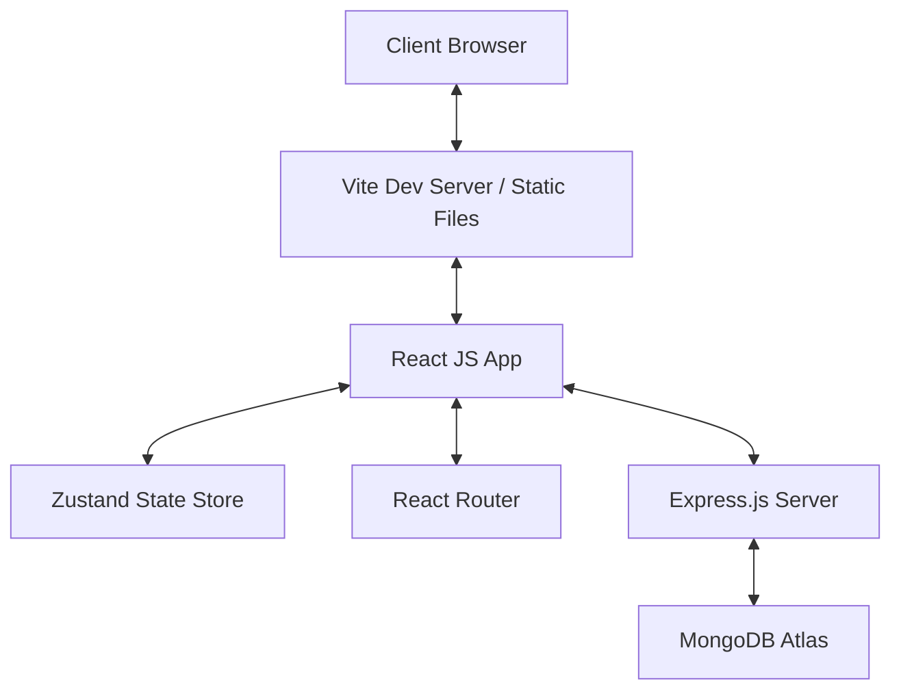

# Project Specifications: Mobile/Tablet Repair & E-Commerce Platform

This document defines the architecture, database schema, API endpoints, and frontend components for the Mobile & Tablet Repair Booking and E-Commerce website.

---

## 1. System Architecture Overview
The platform consists of:
- **Frontend**: A single-page React application built using Vite, styled with Tailwind CSS and DaisyUI. It uses React Router for routing and Zustand for frontend state management (managing the shopping cart and repair booking session state).
- **Backend**: A Node.js and Express.js REST API server.
- **Database**: MongoDB hosted on MongoDB Atlas, using Mongoose for schema modeling.



---

## 2. Database Schema (MongoDB / Mongoose)
To ensure the critical design rule of **Separation of Concerns** and **Database Schema Split**, we define two distinct collections: `products` and `tickets`.

### A. Product Schema (`models/Product.js`)
Stores inventory information for physical items sold in the shop (used phones, tablets, chargers, headphones, unbreakable glass, and watches).

- `name` (String, required): Name of the item.
- `description` (String, required): Description of the item.
- `category` (String, required): Category of the item. Enum: `['phone', 'tablet', 'charger', 'headphones', 'screen-protector', 'watch']`.
- `price` (Number, required, min: 0): Retail price of the item.
- `stock` (Number, required, min: 0): Available stock quantity.
- `images` ([String]): List of image URLs.
- `condition` (String, required): Condition grading tag. Enum: `['Like New', 'Refurbished', 'Minor Scratches', 'New']`.
- `specs` (Map of Strings): Key-value pairs for technical specs (e.g., storage capacity, RAM, battery health).
- `createdAt` (Date): Auto-generated timestamp.
- `updatedAt` (Date): Auto-generated timestamp.

### B. Repair Ticket Schema (`models/RepairTicket.js`)
Stores repair booking data and intake notes. Does not mix with physical checkout workflows.

- `ticketId` (String, required, unique): Format: `REP-YYYYMMDD-XXXX` (random 4-digit suffix). Used by customers to check repair status.
- `customerName` (String, required): Customer's name.
- `customerPhone` (String, required): Customer's phone number for notification/tracking.
- `deviceType` (String, required): Enum: `['phone', 'tablet']`.
- `deviceBrand` (String, required): Brand name (e.g., Apple, Samsung, Google).
- `deviceModel` (String, required): Specific model (e.g., iPhone 14 Pro, Galaxy Tab S8).
- `issue` (String, required): The diagnosed problem. Enum: `['cracked screen', 'charging port', 'buttons', 'audio output', 'other']`.
- `notes` (String): Additional customer notes or repair details.
- `status` (String, required, default: `'Booked'`): Repair progress status. Enum: `['Booked', 'Waiting for Parts', 'In Progress', 'Ready for Pickup', 'Completed', 'Cancelled']`.
- `estimatedPrice` (Number, required): Quoted repair estimation price.
- `createdAt` (Date): Auto-generated timestamp.
- `updatedAt` (Date): Auto-generated timestamp.

---

## 3. REST API Specification

### A. E-Commerce Product Endpoints
- **`GET /api/products`**
  - Query parameters: `category`, `condition`, `search` (text search on name/description).
  - Returns a list of products.
- **`GET /api/products/:id`**
  - Returns details of a specific product.
- **`POST /api/products`** (Admin)
  - Creates a new product.
- **`PUT /api/products/:id`** (Admin)
  - Updates an existing product.
- **`DELETE /api/products/:id`** (Admin)
  - Deletes a product.

### B. Repair & Service Endpoints
- **`POST /api/repairs/book`**
  - Request body: `customerName`, `customerPhone`, `deviceType`, `deviceBrand`, `deviceModel`, `issue`, `notes`, `estimatedPrice`.
  - Creates a new repair ticket and returns the generated `ticketId`.
- **`GET /api/repairs/track`**
  - Query parameters: `ticketId` and/or `customerPhone`.
  - Returns the status and details of the matching repair ticket(s).
- **`GET /api/repairs/prices`**
  - Returns a pricing estimator matrix (starting prices for combinations of device types and common issues).
- **`GET /api/repairs/tickets`** (Admin)
  - Returns a list of all repair tickets.
- **`PUT /api/repairs/tickets/:id`** (Admin)
  - Updates ticket details or changes status (e.g., from `In Progress` to `Ready for Pickup`).

---

## 4. Frontend Navigation & Pages

The user interface is built as a single-page React app with standard navigation:

- **Home Page (`/`)**:
  - Hero section introducing the shop and repair service.
  - Quick access buttons: "Book a Repair" and "Shop Accessories".
  - Pricing Estimator component.
  - Call-to-action for ticket tracking.
- **Repair Booking Page (`/repair/book`)**:
  - Multi-step form (funnel) for booking a repair.
  - Step 1: Select Device Type (`phone` or `tablet`) & Brand.
  - Step 2: Select/Enter Model & Issue (cracked screen, charging port, buttons, audio output).
  - Step 3: Enter Contact Information & Additional Notes.
  - Step 4: Show Price Estimate & Confirm Booking.
  - *Cross-Selling Trigger*: On screen repair selection, display a prompt: "Add unbreakable glass protector for only $15?". If selected, direct them to checkout with the screen protector pre-added to cart, or handle cross-sell.
- **Ticket Tracking Page (`/repair/track`)**:
  - Input form for Phone Number or Ticket ID.
  - Results view showing a detailed status bar (`Booked` -> `Waiting for Parts` -> `In Progress` -> `Ready for Pickup` -> `Completed`).
- **Shop Page (`/shop`)**:
  - Filterable catalog sidebar (by Category and Condition).
  - Grid of Product cards.
  - Search bar.
- **Product Details Page (`/shop/product/:id`)**:
  - Product images, price, description, condition tag, specs.
  - "Add to Cart" button.
- **Cart Page (`/cart`)**:
  - Summary of items to purchase.
  - Quantity controls.
- **Checkout Page (`/checkout`)**:
  - Checkout form for physical items.
- **Admin Dashboard Page (`/admin`)**:
  - Password-protected view.
  - Manage Product Inventory (Add/Edit/Delete products).
  - Manage Repair Tickets (Update statuses).

---

## 5. Zustand State Management Store Layout

### A. Cart Store (`src/features/shop/store/useCartStore.js`)
- `items`: List of cart items `{ product, quantity }`.
- `addToCart(product)`: Appends product or increments quantity.
- `removeFromCart(productId)`: Removes product.
- `updateQuantity(productId, quantity)`: Updates quantity.
- `clearCart()`: Empties the cart.

### B. Repair Booking Store (`src/features/repairs/store/useRepairStore.js`)
- `step`: Current funnel step (1, 2, 3, 4).
- `bookingData`: Current form values `{ deviceType, brand, model, issue, customerName, customerPhone, notes, estimatedPrice }`.
- `setBookingData(newData)`: Merges new field updates.
- `nextStep()` / `prevStep()`: Navigates step index.
- `resetBooking()`: Resets booking states.

---

## 6. Directory Structure
The front-end project will be organized using a feature-based folder structure under `src/`:

```
frontEnd/src/
├── assets/                  # Images, SVGs, logos
├── components/              # Shared UI components (Button, Navbar, Footer, Input, Card)
├── features/
│   ├── shop/                # Shop feature domain
│   │   ├── components/      # ProductCard, ProductGrid, CartSummary
│   │   └── store/           # useCartStore.js
│   └── repairs/             # Repair and tracking feature domain
│       ├── components/      # BookingForm, TicketTracker, PriceEstimator
│       └── store/           # useRepairStore.js
├── pages/                   # Routing container components
│   ├── Home.jsx
│   ├── Shop.jsx
│   ├── ProductDetail.jsx
│   ├── Cart.jsx
│   ├── Checkout.jsx
│   ├── RepairBook.jsx
│   ├── RepairTrack.jsx
│   └── Admin.jsx
├── App.jsx                  # React router configuration
├── App.css
├── index.css                # Global Tailwind directives
└── main.jsx                 # Entry point
```

And backend folder structure:
```
backEnd/
├── src/
│   ├── config/              # Configuration (db.js)
│   ├── controllers/         # Express request handlers (productController, repairController)
│   ├── models/              # Mongoose schemas (Product, RepairTicket)
│   ├── routes/              # Express routers (productRoutes, repairRoutes)
│   ├── middleware/          # Custom middleware (error handlers, validation)
│   └── server.js            # Entry point
├── .env                     # Environment variables (MONGO_URI, PORT)
└── package.json
```
